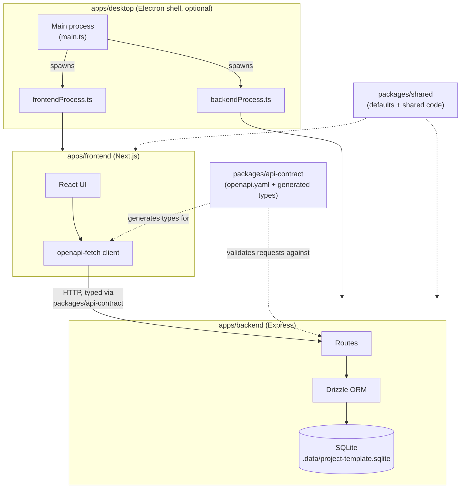

# Project Template

Project Template is a baseplate for spinning up new local, single-user applications
quickly: a pnpm workspace with a Next.js frontend, an Express + SQLite/Drizzle backend
behind an OpenAPI-first contract, and an optional Electron desktop shell with
multi-laptop cloud-sync support already wired up end to end.

This template originated as a capstone project for learning and utilizing AI
(GitHub Copilot).

## Download

Download the latest desktop build from the
[GitHub Releases page](https://github.com/Jambrose777/project-template/releases/latest):

- [Download for macOS (.dmg)](https://github.com/Jambrose777/project-template/releases/latest/download/project-template-mac-arm64.dmg)
- [Download for Windows (.exe)](https://github.com/Jambrose777/project-template/releases/latest/download/project-template-win-setup.exe)

These links point at fixed asset filenames produced by `pnpm package:mac`/
`pnpm package:win` (see [apps/desktop/package.json](apps/desktop/package.json)'s
`build.mac.artifactName`/`build.nsis.artifactName`), so they keep working across
version bumps as long as a GitHub Release with matching-named assets exists. The
artifact names deliberately avoid spaces - GitHub sanitizes uploaded release asset
filenames by converting spaces to dots, so a space-containing `artifactName` no
longer matches the space-encoded (`%20`) link the README expects.
Pushing a version tag (e.g. `v0.1.1`) triggers
[.github/workflows/release.yml](.github/workflows/release.yml), which builds both
installers in CI and attaches them to that tag's release automatically.

See story 3
([docs/stories/ready-for-dev/0003-review-overall-architecture.md](docs/stories/ready-for-dev/0003-review-overall-architecture.md))
for deciding whether a given project built from this template keeps the desktop app at
all.

## Architecture

This repository is a pnpm workspace organized into applications and shared packages:

| Path                    | Purpose                                                                                           |
| ----------------------- | ------------------------------------------------------------------------------------------------- |
| `apps/backend`          | Express REST API backed by SQLite and Drizzle ORM.                                                |
| `apps/frontend`         | Next.js (App Router) React frontend styled with Tailwind CSS.                                     |
| `apps/desktop`          | Electron desktop shell that packages the frontend and backend as a local, single-user executable. |
| `packages/api-contract` | OpenAPI specification and generated TypeScript API types.                                         |
| `packages/shared`       | Defaults and code shared across workspace applications.                                           |
| `docs`                  | Product planning, requirements, API endpoint, and data-type documentation.                        |

The frontend calls the backend using a typed client generated from the OpenAPI
contract. The backend currently exposes `GET /health`, which verifies that both the API
and database are available, and the frontend's home page displays that status.



- In development, the frontend and backend run as separate processes (`pnpm dev`)
  and talk over HTTP on `localhost`.
- In the packaged desktop app, Electron's main process spawns the frontend and
  backend as managed local child processes instead — see story 3
  ([docs/stories/ready-for-dev/0003-review-overall-architecture.md](docs/stories/ready-for-dev/0003-review-overall-architecture.md))
  for deciding whether a given project needs this at all.
- `packages/api-contract`'s `openapi.yaml` is the source of truth for the API shape:
  it generates the frontend's typed client and validates every backend request/
  response at runtime (`express-openapi-validator`).

## Getting started

### Prerequisites

- Node.js 24.18.1
- pnpm 11.18.0

Install dependencies and start the backend and frontend development servers together:

```sh
pnpm install
pnpm dev
```

The backend listens on `http://127.0.0.1:3001` and the frontend on `http://localhost:3000`
by default; `pnpm dev` runs both concurrently and prints both URLs. Verify the backend
from another terminal:

```sh
curl http://127.0.0.1:3001/health
```

A healthy response is:

```json
{ "status": "ok", "database": "connected" }
```

Open `http://localhost:3000` in a browser to see the frontend's home page, which calls
the backend's health check and reports whether it is connected.

The local database is created at `.data/project-template.sqlite` by default.

To run only one side, use `pnpm dev:backend` or `pnpm dev:frontend`.

### Desktop app

`apps/desktop` wraps the frontend and backend in Electron so the app can run as a
local, single-user desktop executable with no separate dev server or terminal
commands required.

To run the desktop shell in development mode (bundles `apps/desktop`'s own main/preload
code with esbuild, then launches Electron):

```sh
pnpm dev:desktop
```

To build a distributable, unsigned/unnotarized installer for the current platform, the
packaging pipeline first stages production-only builds of the backend and frontend
(via `pnpm deploy`), rebuilds their native dependencies (`better-sqlite3`) against
Electron's Node ABI, then runs `electron-builder`:

```sh
pnpm package:mac    # macOS .dmg, output to apps/desktop/release/
pnpm package:win    # Windows NSIS installer, output to apps/desktop/release/
```

Packaging can take a few minutes on first run. There is no auto-updater; each build
produces a standalone installer.

The release workflow is disabled by default in this template (see
[story 5](docs/stories/ready-for-dev/0005-enable-and-test-release-workflow.md)) — its
`push` tag trigger is commented out in
[.github/workflows/release.yml](.github/workflows/release.yml) until the packaged
installers have been verified on each platform. Until then, publish a release by
running the workflow manually via `workflow_dispatch` from the GitHub Actions tab,
supplying an existing tag name. Once story 5 is done, publishing a release is as
simple as pushing a tag matching `v*.*.*`:

```sh
git tag v0.1.0
git push origin v0.1.0
```

This triggers [.github/workflows/release.yml](.github/workflows/release.yml), which
builds both installers in CI and uploads them to that tag's GitHub Release, matching
the filenames the "Download" section links to above. To rebuild and re-upload for an
existing tag instead, run the workflow manually via `workflow_dispatch` from the
GitHub Actions tab, supplying that tag name.

## Commands

| Command             | Description                                                                |
| ------------------- | -------------------------------------------------------------------------- |
| `pnpm dev`          | Run the backend and frontend together in watch mode.                       |
| `pnpm dev:backend`  | Run only the backend in watch mode.                                        |
| `pnpm dev:frontend` | Run only the frontend in watch mode.                                       |
| `pnpm dev:desktop`  | Build and launch the Electron desktop shell in development mode.           |
| `pnpm build`        | Build shared packages, generated API types, the backend, and the frontend. |
| `pnpm typecheck`    | Type-check every workspace package.                                        |
| `pnpm lint`         | Run ESLint across the repository.                                          |
| `pnpm test`         | Build the workspace and run backend and frontend tests.                    |
| `pnpm format`       | Format supported repository files with Prettier.                           |
| `pnpm format:check` | Check formatting without changing files.                                   |
| `pnpm package:mac`  | Build a macOS `.dmg` installer for the desktop app.                        |
| `pnpm package:win`  | Build a Windows NSIS installer for the desktop app.                        |

## Configuration

The backend supports these environment variables:

| Variable                    | Default                                        | Purpose                                                                                                             |
| --------------------------- | ---------------------------------------------- | ------------------------------------------------------------------------------------------------------------------- |
| `HOST`                      | `127.0.0.1`                                    | Address on which the backend listens.                                                                               |
| `PORT`                      | `3001`                                         | Backend HTTP port.                                                                                                  |
| `FRONTEND_ORIGIN`           | `http://localhost:3000`                        | Origin allowed by CORS.                                                                                             |
| `APP_DATA_DIRECTORY`        | `.data`                                        | Directory for local application data - can be pointed at a cloud-sync client's folder to share data across laptops. |
| `DATABASE_FILE`             | `<APP_DATA_DIRECTORY>/project-template.sqlite` | SQLite database path.                                                                                               |
| `APP_LOCAL_STATE_DIRECTORY` | `.local-state`                                 | Always-local directory (never the cloud-synced `APP_DATA_DIRECTORY`) for automatic backup snapshots.                |

The frontend supports this environment variable:

| Variable                  | Default                 | Purpose                            |
| ------------------------- | ----------------------- | ---------------------------------- |
| `NEXT_PUBLIC_BACKEND_URL` | `http://127.0.0.1:3001` | Backend origin the frontend calls. |

## Project documentation

- [Product planning and tech stack](docs/planning.md)
- [Story index](docs/stories/README.md)
- [API endpoint index](docs/api-endpoints.md)
- [Data types and modeling decisions](docs/data-types.md)
- [Story requirements workflow](docs/story-requirements-workflow.md)
